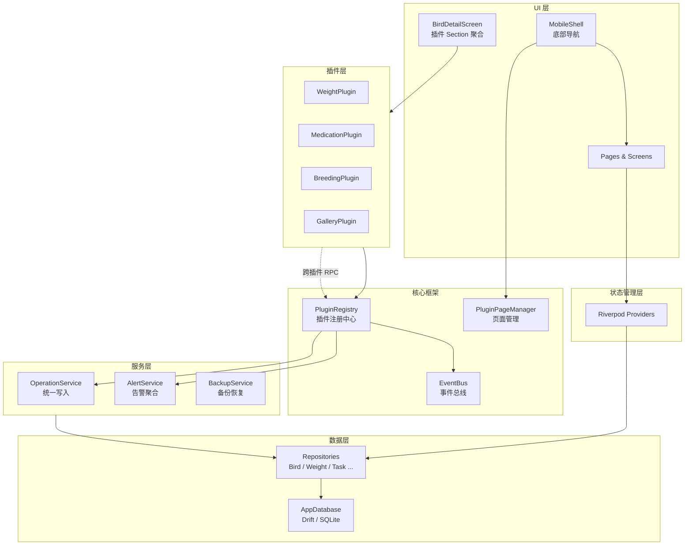
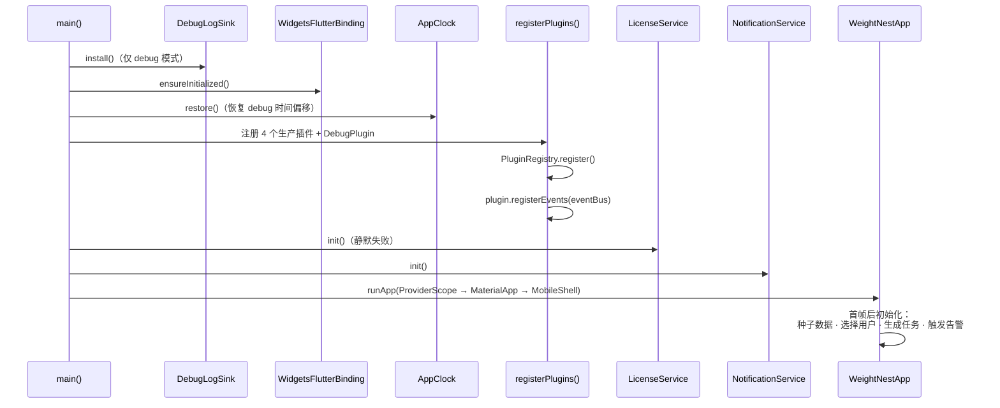

# 架构设计

WeightNest 采用**插件式模块化单体**架构，基于 Flutter + Riverpod + Drift 技术栈构建。核心设计思想是将每个功能领域封装为独立插件，通过 Slot（扩展点）机制注入到应用中，实现高内聚、低耦合的模块化设计。

---

## 整体架构



---

## 分层说明

### 1. UI 层（`lib/screens/`, `lib/widgets/`）

- **MobileShell** — 应用外壳，底部 4 个 Tab（首页、任务、鸟只、设置），懒加载 Tab 内容
- **BirdDetailScreen** — 鸟只详情页，动态聚合所有启用插件的 `DetailSection`
- 首页动态渲染插件贡献的 `QuickAction`、容器称重按钮、房间称重按钮

### 2. 插件层（`lib/plugins/`）

每个功能领域是一个 `FeaturePlugin` 子类，通过 Slot 机制声明自己的贡献：

| 插件 | 职责 |
|------|------|
| WeightPlugin | 体重追踪、EWMA 基线分析、多维度告警、称重任务生成 |
| MedicationPlugin | 用药方案、剂量计算、喂药记录、药品库、疾病目录 |
| BreedingPlugin | 配对管理、繁育记录、产蛋孵化 |
| GalleryPlugin | 照片存储、头像管理、实况照片 |
| DebugPlugin | 调试仪表盘（仅 debug 模式注册） |

> 详见 [插件系统](plugin-system.md) 和 [内置插件详解](plugins-guide.md)

### 3. 核心框架层（`lib/core/`）

| 组件 | 职责 |
|------|------|
| **FeaturePlugin** | 插件抽象接口，定义 11 个 Slot 扩展点 |
| **PluginRegistry** | 全局单例，管理所有插件的注册、启用/禁用、聚合 |
| **EventBus** | 轻量同步类型化事件总线，插件间解耦通信 |
| **PluginPageManager** | 管理插件页面实例，支持唯一性约束（singleton / perBird） |
| **AppClock** | 可注入时钟，支持 debug 模式时间偏移，Release 零开销 |

### 4. 服务层（`lib/services/`）

| 服务 | 职责 |
|------|------|
| **OperationService** | 统一写入入口 — 每次写操作在同一事务中：写入 ActivityLog → 自动完成任务 → 发送 EventBus 事件 |
| **AlertService** | 聚合所有启用插件的 `detectAlerts()`，去重后持久化，触发本地通知 |
| **BackupService** | WNBK 格式（ZIP + SHA256）完整备份/恢复 |
| **BirdImportService / BirdExportService** | WNBD 格式鸟只导入导出 |
| **ExcelExportService** | 月度体重矩阵报表、药品库导出 |
| **LicenseService** | Pro 版本激活码验证（HMAC-SHA256） |
| **NotificationService** | 本地通知调度，双 Android 通道 |
| **MotionPhotoService** | Android 实况照片视频提取 |

> 详见 [服务层](services.md)

### 5. 状态管理层（`lib/providers.dart`）

使用 **flutter_riverpod** 进行状态管理。所有 Provider 集中定义在 `providers.dart` 中。

核心模式：
- **FutureProvider** — 异步数据查询（如 `allBirdsProvider`、`todayTasksProvider`）
- **FutureProvider.family** — 参数化查询（如 `birdWeightsProvider(birdId)`）
- **StateProvider** — 手动失效计数器（如 `weightSavedProvider`，保存体重后递增触发刷新）
- **StateNotifierProvider** — 可变状态（如 `ThemeModeNotifier`）

### 6. 数据层（`lib/database/`, `lib/repositories/`）

**AppDatabase** — 单一 Drift 数据库实例，包含 25 张表，当前 Schema 版本 v17。

**Repository 模式** — 所有 Repository 实现为 `extension on AppDatabase`（Drift Extension 模式），数据库对象本身即为 Repository。

> 详见 [数据库设计](database.md)

---

## 启动流程



详细启动步骤：

1. **DebugLogSink.install()** — 在 `WidgetsFlutterBinding` 之前安装日志拦截器（捕获启动日志）
2. **WidgetsFlutterBinding.ensureInitialized()** — Flutter 绑定初始化
3. **AppClock.restore()** — 恢复 debug 时间偏移（持久化到 SharedPreferences）
4. **registerPlugins()** — 注册 Weight、Medication、Breeding、Gallery 插件；debug 模式额外注册 DebugPlugin
5. **LicenseService().init()** — 静默初始化（Pro 版本验证）
6. **NotificationService.instance.init()** — 本地通知通道初始化
7. **SystemChrome.setPreferredOrientations()** — 强制竖屏
8. **runZonedGuarded()** — 启动应用，捕获全局未处理异常

**首帧后初始化**（MobileShell `initState`）：
- 种子数据（默认品种 + 管理员用户）
- 自动选择上次用户
- 生成今日任务
- 触发告警检测
- 每 5 分钟周期性重新生成任务

---

## 核心设计决策

### 为什么选择插件式架构？

传统的 Flutter 应用通常按功能拆分目录（如 `features/weight/`、`features/medication/`），各功能通过直接导入互相依赖。WeightNest 的插件架构在此基础上引入了**声明式 Slot 机制**：

| 传统方式 | 插件方式 |
|---------|---------|
| 新功能需要修改 5+ 个文件 | 实现接口 + 注册一行代码 |
| 功能间直接 import 依赖 | 通过 EventBus / RPC 解耦 |
| UI 耦合在页面代码中 | 插件声明 Section，页面自动聚合 |
| 告警/任务逻辑散布各处 | 插件统一实现 `detectAlerts()` / `detectTasks()` |

### OperationService — 统一写入入口

所有插件的写操作通过 `OperationService.record()` 进入，在**同一个事务**中完成三件事：

1. 写入 `ActivityLog`（统一审计日志）
2. 自动完成关联的 `Task`
3. 通过 `EventBus` 发送 `OperationRecordedEvent`

这确保了：
- 完整的操作审计追踪
- 写操作与任务自动关联（称重后自动标记称重任务完成）
- 插件间的响应式联动（如喂药后体重插件可做额外判断）

### Repository = Drift Extension

Repository 实现为 `extension on AppDatabase`，而非独立的 Repository 类。这意味着：

- 数据库对象本身就是 Repository，无需额外实例化
- Provider 中直接 `db.someQuery()` 即可
- 减少了抽象层次，适合单机 MVP 的简洁需求

### 软删除 + UUID

所有核心表使用：
- `deletedAt` nullable DateTime — 软删除，保留数据恢复能力
- `uuid` unique Text — 全局唯一标识，用于导入导出和跨设备同步

---

## 事件驱动数据流

```mermaid
flowchart LR
    A[用户操作<br>称重/喂药/...] --> B[Plugin 写方法]
    B --> C[OperationService<br>.record()]
    C --> D[SQLite 事务]
    D --> D1[写入业务数据]
    D --> D2[写入 ActivityLog]
    D --> D3[自动完成 Task]
    C --> E[EventBus<br>.emit OperationRecordedEvent]
    E --> F[订阅插件<br>响应事件]
    F --> G[Riverpod<br>Provider 刷新]
```
