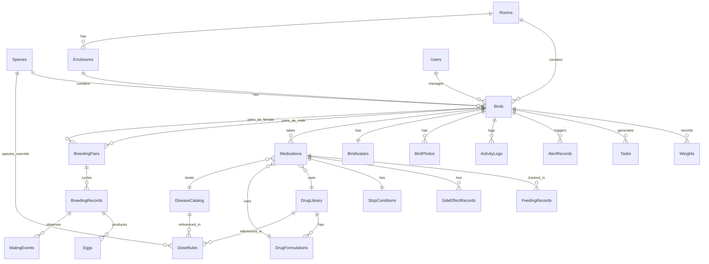

# 数据库设计

WeightNest 使用 [Drift](https://drift.simonbinder.eu/)（原 moor）作为 SQLite ORM 框架。所有数据存储在单一 SQLite 数据库文件 `weight_nest_mvp.db` 中，当前 Schema 版本 **v17**。

> 核心代码：`lib/database/database.dart`、`lib/database/tables.dart`

---

## 概览

| 指标 | 值 |
|------|-----|
| Schema 版本 | 17 |
| 总表数 | 25（核心 14 + 药品 8 + 相册 2 + 遗留 1） |
| 迁移策略 | 增量迁移（`onUpgrade: from → to`） |
| 软删除 | 核心表使用 `deletedAt` nullable DateTime |
| 唯一标识 | 每张表有 `uuid` unique Text 字段 |
| 测试支持 | `AppDatabase.test()` 内存数据库、`AppDatabase.file(File)` 文件数据库 |

---

## ER 关系图



---

## 表结构详解

### 核心表（`lib/database/tables.dart`）

#### Species — 品种表

| 字段 | 类型 | 说明 |
|------|------|------|
| id | `int` AI | 主键 |
| uuid | `text` UQ | 全局唯一 ID |
| name | `text(50)` | 品种名称 |
| nestlingEndDays | `int` Default 45 | 雏鸟阶段结束天数 |
| juvenileEndDays | `int` Default 120 | 幼鸟阶段结束天数 |
| nestlingWeighIntervalDays | `int` Default 1 | 雏鸟称重间隔 |
| juvenileWeighIntervalDays | `int` Default 3 | 幼鸟称重间隔 |
| adultWeighIntervalDays | `int` Default 7 | 成鸟称重间隔 |
| minWeightG / maxWeightG | `real?` | 品种正常体重范围（剂量安全校验） |
| deletedAt | `datetime?` | 软删除 |

#### Birds — 鹦鹉表

| 字段 | 类型 | 说明 |
|------|------|------|
| id | `int` AI | 主键 |
| uuid | `text` UQ | 全局唯一 ID |
| name | `text(50)` | 鹦鹉名称 |
| ringNumber | `text(30)?` | 脚环号 |
| speciesId | `int` FK→Species | 品种 |
| roomId | `int?` FK→Rooms | 所在房间 |
| enclosureId | `int?` FK→Enclosures | 所在容器（级联删除→SET NULL） |
| birthDate | `datetime` | 出生日期 |
| gender | `text(10)` Default '未知' | 公/母/未知 |
| weighIntervalDays | `int?` | 称重间隔覆盖（null=品种默认） |
| manualBaselineG | `real?` | 手动基准体重（null=自动 EWMA） |
| weaningOverride | `bool?` | 断奶期覆盖（null=自动检测） |
| status | `text(20)` Default '正常' | 正常/异常/已离舍 |
| deletedAt | `datetime?` | 软删除 |

#### Weights — 体重记录表

| 字段 | 类型 | 说明 |
|------|------|------|
| id | `int` AI | 主键 |
| uuid | `text` UQ | 全局唯一 ID |
| birdId | `int` FK→Birds CASCADE | 鹦鹉 |
| weightG | `real` | 体重（克），保留一位小数 |
| recordedAt | `datetime` | 记录时间 |
| recordedBy | `int?` FK→Users | 记录人 |
| isFasting | `bool` Default true | 是否空腹 |
| notes | `text(200)?` | 备注 |

> **去重逻辑**：同一只鸟在同一分钟内的记录会覆盖（upsert 1-minute window）。

#### Tasks — 待办任务表

| 字段 | 类型 | 说明 |
|------|------|------|
| id | `int` AI | 主键 |
| uuid | `text` UQ | 全局唯一 ID |
| birdId | `int` FK→Birds CASCADE | 鹦鹉 |
| roomId | `int?` FK→Rooms | 房间（冗余字段，方便按房间筛选） |
| assignedUserId | `int?` | 指派人 |
| taskType | `text(20)` Default 'weigh' | 任务类型：weigh / medication |
| dueDate | `datetime` | 任务日期 |
| deadline | `datetime?` | 逾期截止时间 |
| status | `text(20)` Default '待完成' | 待完成/已完成/逾期/已跳过 |
| completedAt | `datetime?` | 完成时间 |
| completedBy | `int?` | 完成人 |
| metadata | `text?` JSON | 插件私有数据（如 drugName/dosage） |

> **去重键**：`(birdId, taskType, dueDate)` — 由 TaskRepository 处理。

#### ActivityLogs — 统一操作日志表

所有插件行为的流水账，是跨插件审计追踪的核心。

| 字段 | 类型 | 说明 |
|------|------|------|
| id | `int` AI | 主键 |
| uuid | `text` UQ | 全局唯一 ID |
| birdId | `int?` FK→Birds SET NULL | 关联鹦鹉 |
| pluginId | `text(30)` | 来源插件：weights / medication / breeding |
| actionType | `text(30)` | 操作类型：weight_recorded / medication_given / ... |
| summary | `text(200)` | 人类可读摘要 |
| details | `text?` JSON | 操作详情 |
| relatedTaskId | `int?` FK→Tasks SET NULL | 自动完成的任务 |
| operatedBy | `int?` FK→Users | 操作人 |
| operatedAt | `datetime` Default now | 操作时间 |

#### AlertRecords — 异常提醒表

| 字段 | 类型 | 说明 |
|------|------|------|
| id | `int` AI | 主键 |
| uuid | `text` UQ | 全局唯一 ID |
| birdId | `int` FK→Birds CASCADE | 鹦鹉 |
| alertType | `text(30)` | 提醒类型 |
| description | `text(500)` | 提醒详情 |
| severity | `text(10)` | warning / danger |
| isRead / isResolved | `bool` Default false | 已读/已解决状态 |

#### BreedingPairs — 繁育配对表

| 字段 | 类型 | 说明 |
|------|------|------|
| maleBirdId | `int` FK→Birds CASCADE | 公鸟 |
| femaleBirdId | `int` FK→Birds CASCADE | 母鸟 |
| pairName | `text?` | 配对名称（如"蓝公×绿母"） |
| status | `text` Default 'active' | active / separated |

#### BreedingRecords / Eggs / MatingEvents — 繁育记录

完整的繁育周期管理：配对→产蛋→孵化→育雏→已完结。

### 药品系统表（`lib/plugins/medication/medication_tables.dart`）

> v17 引入的全新药品剂量库系统，替换了旧的简单 medications 表。

| 表 | 说明 |
|------|------|
| **DrugLibrary** | 药品库（名称、成分、类别、剂型） |
| **DrugFormulations** | 药品规格/浓度（如 25mg/mL、50mg/mL） |
| **DiseaseCatalog** | 疾病目录 |
| **DoseRules** | 剂量规则（药品+疾病+品种 → mg/kg、次数/天、疗程） |
| **Medications** | 喂药方案（关联药品/规格/疾病，自动或手动剂量） |
| **FeedingRecords** | 喂药记录（已喂/吐出/漏喂/补喂/拒绝） |
| **SideEffectRecords** | 副作用记录（拉稀/食欲下降/呕吐/...） |
| **StopConditions** | 停药条件 |

### 相册表（`lib/plugins/gallery/gallery_tables.dart`）

| 表 | 说明 |
|------|------|
| **BirdPhotos** | 鸟只照片（支持 photo / motion_photo） |
| **BirdAvatars** | 鸟只头像（每只鸟一个） |

### 遗留表

| 表 | 说明 |
|------|------|
| **SyncQueue** | 离线同步队列（MVP 中不再使用，保留兼容） |

---

## Schema 迁移历史

数据库从 v1 演进到 v17，采用增量迁移策略：

| 版本 | 变更 |
|------|------|
| **v1→v2** | 初始 Schema（Species, Users, Rooms, Birds, Weights, Tasks, AlertRecords） |
| **v3** | 品种/鹦鹉称重间隔列：`nestlingWeighIntervalDays`、`juvenileWeighIntervalDays`、`weighIntervalDays` |
| **v4** | 性能索引：weights、tasks、activity_logs |
| **v5** | 初始药品追踪表（旧版 medications，后被 v17 替换） |
| **v6** | 容器系统：Enclosures 表、Birds.enclosureId |
| **v7** | 基准体重：Birds.manualBaselineG、Birds.weaningOverride |
| **v8** | 繁育插件：BreedingPairs、BreedingRecords、Eggs、MatingEvents |
| **v9** | Tasks.taskType + metadata；删除旧 medication_logs |
| **v10** | AlertRecords.severity（告警严重程度） |
| **v11** | 统一操作日志：ActivityLogs 表 |
| **v12** | 性能索引：birds(room_id)、birds(enclosure_id)、alert_records、medications |
| **v13** | 任务截止时间：Tasks.deadline（存量任务回填） |
| **v14** | 相册插件：BirdPhotos、BirdAvatars |
| **v15** | 实况照片支持：mediaType、videoFilePath |
| **v16** | 动态缩略图：thumbnailPath（animated WebP） |
| **v17** | ⚠️ **Breaking** — 药品剂量库系统重构：删除旧 medications，创建 DrugLibrary / DrugFormulations / DiseaseCatalog / DoseRules / Medications / FeedingRecords / SideEffectRecords / StopConditions |

### 迁移注意事项

- **v14 防重复迁移**：当从 v13 以下直接升级时，`createTable(birdPhotos)` 会包含所有列（mediaType/videoFilePath/thumbnailPath），后续的 `addColumn` 步骤需要跳过。通过 `birdPhotosJustCreated` 标志位控制。
- **v17 数据丢失**：旧 medications 表被直接删除，不保留数据。这是有意的 breaking change。
- **性能索引**：每次新增表后通常伴随索引创建，确保高频查询路径高效。

---

## Repository 模式

WeightNest 使用 **Drift Extension 模式**，Repository 实现为 `extension on AppDatabase`：

```dart
// lib/repositories/weight_repository.dart
extension WeightRepository on AppDatabase {
  Future<List<Weight>> getWeightsByBird(int birdId) =>
      (select(weights)..where((w) => w.birdId.equals(birdId)))
          .get();

  // 同一分钟 upsert
  Future<int> insertWeight(WeightCompanion entry) async {
    // 1分钟内已有记录则更新，否则插入
    ...
  }

  // 批量查询消除 N+1
  Future<Map<int, Weight?>> getLatestByBirds(List<int> birdIds) =>
      customSelect(...).get();
}
```

### Repository 一览

| Repository | 文件 | 核心方法 |
|------------|------|---------|
| BirdRepository | `bird_repository.dart` | `getAllWithDetails()`、`search()`、`getByEnclosure()` |
| WeightRepository | `weight_repository.dart` | `insertWeight()`（同分钟 upsert）、`getLatestByBirds()`（批量）、`getByBirdsInRange()` |
| TaskRepository | `task_repository.dart` | `generateTodayTasks()`（聚合插件任务）、`getTodayTasks()`、60秒节流 |
| SpeciesRepository | `species_repository.dart` | CRUD + `upsertByUuid()`（导入用） |
| RoomRepository | `room_repository.dart` | CRUD |
| EnclosureRepository | `enclosure_repository.dart` | CRUD + `getAllEnclosureCounts()`（优化单 SQL） |
| UserRepository | `user_repository.dart` | CRUD |
| MedicationRepository | `medication/medication_repository.dart` | 方案 CRUD + 喂药记录 |
| DrugLibraryRepository | `medication/drug_library_repository.dart` | 药品/疾病/剂量规则管理 |

---

## 数据库连接

```dart
// 生产环境
AppDatabase() : super(driftDatabase(name: 'weight_nest_mvp.db'));

// 测试环境（内存）
AppDatabase.test() : super(DatabaseConnection(NativeDatabase.memory()));

// 文件数据库（备份恢复测试）
AppDatabase.file(File file)
    : super(DatabaseConnection(NativeDatabase(file)));
```

---

## 自定义索引

| 索引名 | 表 | 列 | 用途 |
|--------|-----|-----|------|
| `idx_weights_bird_date` | weights | (bird_id, recorded_at DESC) | 按鸟查体重 |
| `idx_tasks_due_status` | tasks | (due_date, status) | 今日任务查询 |
| `idx_activity_logs_bird_time` | activity_logs | (bird_id, operated_at DESC) | 操作时间线 |
| `idx_birds_room` | birds | room_id | 按房间筛选鸟只 |
| `idx_birds_enclosure` | birds | enclosure_id | 按容器筛选鸟只 |
| `idx_alert_records_lookup` | alert_records | (bird_id, alert_type, is_read, created_at) | 告警去重与查询 |
| `idx_medications_bird` | medications | bird_id | 按鸟查喂药方案 |
| `idx_bird_photos_bird` | bird_photos | (bird_id, sort_order ASC) | 照片排序 |
| `idx_dose_rules_lookup` | dose_rules | (drug_id, disease_id, species_id) | 剂量规则匹配 |
| `idx_drug_formulations_drug` | drug_formulations | drug_id | 按药品查规格 |
| `idx_feeding_records_med` | feeding_records | (medication_id, fed_at DESC) | 喂药记录时间线 |
| `idx_side_effect_records_med` | side_effect_records | medication_id | 副作用查询 |
