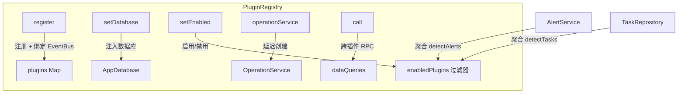
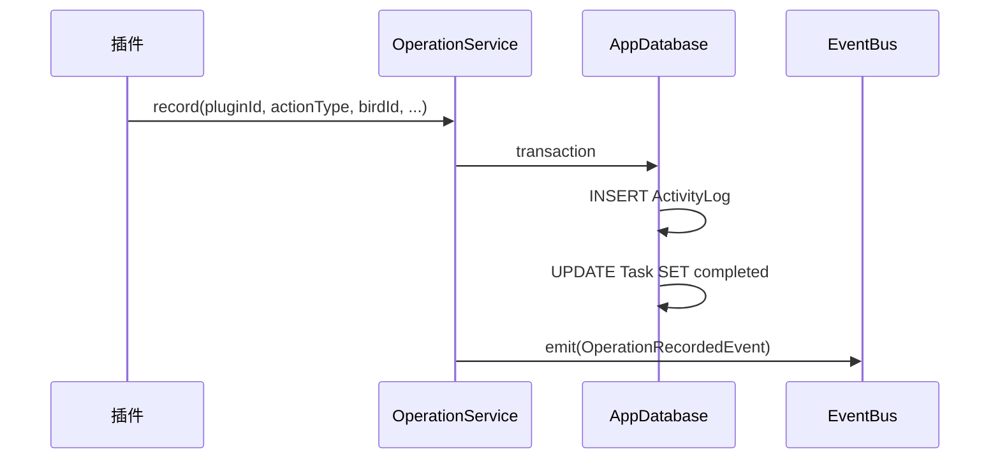

# 插件系统

插件系统是 WeightNest 架构的核心。每个功能领域（体重、用药、繁育、相册）都是一个独立的 `FeaturePlugin` 子类，通过**Slot（扩展点）**机制声明自己对应用的贡献。

> 核心代码位于 `lib/core/plugin.dart`、`lib/core/plugin_registry.dart`、`lib/core/event_bus.dart`

---

## FeaturePlugin 接口

`FeaturePlugin` 是一个抽象类，定义了插件的**身份**和**11 个 Slot 扩展点**：

### 身份属性

| 属性 | 类型 | 说明 |
|------|------|------|
| `id` | `String` | 唯一标识符，如 `'weight'`、`'medication'` |
| `displayName` | `String` | 导航中显示的名称 |
| `description` | `String` | 插件描述（显示在设置页） |
| `icon` | `IconData` | 导航图标 |
| `selectedIcon` | `IconData?` | 选中状态图标 |
| `enabled` | `bool` | 是否启用（可运行时切换） |

### 核心声明

| 属性 | 说明 |
|------|------|
| `tables` | 插件贡献的 Drift 表定义（用于 Schema 生成） |
| `routes(db)` | 插件的路由表（路径 → WidgetBuilder） |

### Slot 扩展点一览

| Slot | 方法 | 用途 |
|------|------|------|
| **B — 鸟只详情** | `buildDetailSections(birdId)` | 在鸟只详情页注入 Section |
| **D — 日历视图** | `calendarTitle` / `buildDayView(day)` | 贡献日历内容 |
| **E — 首页快捷操作** | `quickActions` | 首页快捷按钮 |
| **G — 容器称重** | `enclosureWeighAction` | 容器卡片上的称重按钮 |
| **H — 房间称重** | `roomWeighAction` | 房间卡片上的称重按钮 |
| **F — 告警检测** | `detectAlerts(db, birdId?)` | 异常检测（由 AlertService 聚合） |
| **G — 任务派发** | `detectTasks(db, birdId?)` | 任务生成（由 TaskRepository 聚合） |
| **I — 鸟只头像** | `buildAvatar(birdId, size, onTap)` | 自定义头像组件 |
| — | `dataQueries` | 暴露给其他插件的查询接口 |
| — | `settingsBuilder` | 插件设置页面 |
| — | `registerEvents(bus)` | 订阅领域事件 |
| — | `onTaskCardTap(context, birdId)` | 任务卡片点击导航 |

---

## PluginRegistry — 插件注册中心

`PluginRegistry`（`lib/core/plugin_registry.dart`）是全局单例，负责：

### 核心职责



### 关键方法

| 方法 | 说明 |
|------|------|
| `register(plugin)` | 注册插件并绑定 EventBus |
| `setDatabase(db)` | 一次性注入数据库实例（启动后调用） |
| `setEnabled(id, enabled)` | 运行时启用/禁用插件 |
| `call(pluginId, query, arg)` | 跨插件 RPC（调用目标插件的 `dataQueries`） |
| `getPlugin(id)` | 按 ID 查找插件 |
| `enabledPlugins` | 过滤返回已启用的插件列表 |
| `allTables` | 聚合所有启用插件的表定义 |
| `allRoutes(db)` | 聚合所有启用插件的路由 |
| `operationService` | 延迟创建的统一写入服务 |

---

## EventBus — 类型化事件总线

轻量级同步事件总线（`lib/core/event_bus.dart`），用于插件间的解耦通信。

### API

```dart
// 注册事件处理器
final unsubscribe = eventBus.on<OperationRecordedEvent>((event) {
  print('插件 ${event.pluginId} 执行了 ${event.actionType}');
});

// 发送事件
eventBus.emit(OperationRecordedEvent(
  logId: 42,
  pluginId: 'weights',
  actionType: 'weight_recorded',
  birdId: 1,
  summary: '称重: 45.2g',
  operatedAt: DateTime.now(),
));

// 清理
unsubscribe();  // 或 eventBus.clear<T>()
```

### OperationRecordedEvent

每次写操作后由 `OperationService` 自动发送的事件：

| 字段 | 类型 | 说明 |
|------|------|------|
| `logId` | `int` | ActivityLog 记录 ID |
| `pluginId` | `String` | 来源插件 ID |
| `actionType` | `String` | 操作类型（如 `weight_recorded`、`medication_given`） |
| `birdId` | `int?` | 关联鸟只 ID |
| `summary` | `String` | 人类可读摘要 |
| `details` | `Map?` | JSON 格式的操作详情 |
| `relatedTaskId` | `int?` | 自动完成的任务 ID |
| `operatedBy` | `int?` | 操作人 ID |
| `operatedAt` | `DateTime` | 操作时间 |

---

## OperationService — 统一写入入口

`OperationService`（`lib/services/operation_service.dart`）确保每次插件写操作产生完整的审计记录。

### 写入流程



### API

```dart
// 独立写入（自动开启事务）
await operationService.record(
  pluginId: 'weights',
  actionType: 'weight_recorded',
  birdId: bird.id,
  summary: '称重: 45.2g',
  details: {'weightId': weight.id, 'weightG': 45.2},
  relatedTaskId: taskId,
  operatedBy: currentUserId,
);

// 参与外部事务（用于复合写操作）
await operationService.recordInTransaction(
  db: db,  // 已有的事务上下文
  pluginId: 'medication',
  actionType: 'medication_given',
  ...
);

// 撤销操作（重置关联任务状态、删除日志）
await operationService.revokeOperation(logId);
```

---

## 跨插件 RPC 机制

插件可通过 `dataQueries` 暴露查询接口，其他插件通过 `registry.call()` 调用：

```dart
// MedicationPlugin 暴露接口
@override
Map<String, Function> get dataQueries => {
  'getPlans': (int birdId) => medicationRepo.getPlansByBird(birdId),
  'getAllDrugs': () => drugRepo.getAll(),
  'calculateDosage': (Map<String, dynamic> args) => /* ... */,
};

// WeightPlugin 调用
final breedingBirdIds = await pluginRegistry
    .call('breeding', 'getActiveBreedingBirdIds', null);
```

**现有跨插件调用关系：**

| 调用方 | 目标插件 | 查询 | 用途 |
|--------|---------|------|------|
| WeightPlugin | BreedingPlugin | `getActiveBreedingBirdIds` | 跳过繁育期鸟只的超期告警 |
| WeightPlugin | MedicationPlugin | — | 监听喂药事件（记录日志） |

---

## PluginPageManager — 页面实例管理

`PluginPageManager`（`lib/core/plugin_page_manager.dart`）管理插件打开的页面实例，继承 `ChangeNotifier`。

### 唯一性约束

| 类型 | 说明 | 示例 |
|------|------|------|
| `none` | 允许多个实例 | — |
| `singleton` | 全局仅一个 | 药品库配置 |
| `perBird` | 每只鸟一个 | 称重录入页面 |

```dart
// 打开页面（自动处理唯一性）
pageManager.openPage('weight', weighDescriptor, birdId: 1);
// 如果已有 birdId=1 的称重页面，自动切换到该页面而非打开新的

// 关闭页面
pageManager.closePage(index);

// 切换到指定页面
pageManager.focusPage(index);
```

---

## 如何添加新插件

以下步骤以添加一个"健康管理"（Health）插件为例：

### Step 1: 创建插件类

```dart
// lib/plugins/health/health_plugin.dart
class HealthPlugin extends FeaturePlugin {
  @override
  String get id => 'health';

  @override
  String get displayName => '健康管理';

  @override
  IconData get icon => Icons.health_and_safety;

  @override
  List<dynamic> get tables => []; // 如需新表，在此声明

  @override
  Map<String, WidgetBuilder> routes(AppDatabase db) => {
    '/health': (_) => HealthScreen(db: db),
  };

  // 按需实现 Slot 方法...
  @override
  List<DetailSection> buildDetailSections(int birdId) => [
    DetailSection(
      title: '健康档案',
      icon: Icons.medical_information,
      priority: 50,
      child: HealthSection(birdId: birdId),
    ),
  ];

  @override
  Future<List<PluginAlert>> detectAlerts(AppDatabase db, {int? birdId}) async {
    // 异常检测逻辑
    return [];
  }

  @override
  Future<List<PluginTaskDescriptor>> detectTasks(AppDatabase db, {int? birdId}) async {
    // 任务生成逻辑
    return [];
  }
}
```

### Step 2: 注册插件

```dart
// lib/plugins/plugins.dart
void registerPlugins() {
  pluginRegistry
    ..register(WeightPlugin())
    ..register(MedicationPlugin())
    ..register(BreedingPlugin())
    ..register(GalleryPlugin())
    ..register(HealthPlugin());  // ← 新增
}
```

### Step 3: 如需新数据库表

```dart
// lib/plugins/health/health_tables.dart
class HealthRecords extends Table {
  IntColumn get id => integer().autoIncrement()();
  IntColumn get birdId => integer().references(Birds, #id)();
  TextColumn get recordType => text()();
  // ...
}
```

然后在 `database.dart` 的 `@DriftDatabase(tables: [...])` 注解中添加 `HealthRecords`，并实现 Schema 迁移。

### Step 4: 按需添加 Provider

在 `lib/providers.dart` 中添加所需的数据 Provider。

---

## 支持类型一览

### DetailSection — 鸟只详情区块

```dart
DetailSection(
  title: '体重趋势',
  icon: Icons.show_chart,
  priority: 10,           // 数字越小越靠前
  defaultExpanded: true,  // 默认展开
  child: WeightChart(...),
)
```

### QuickAction — 首页快捷按钮

```dart
QuickAction(
  label: '批量称重',
  icon: Icons.scale,
  builder: () => WeighGridScreen(),
)
```

### PluginAlert — 告警

```dart
PluginAlert(
  birdId: 1,
  type: 'weight_decline',
  description: '体重连续下降 15%',
  severity: AlertSeverity.danger,
)
```

### PluginTaskDescriptor — 任务

```dart
PluginTaskDescriptor(
  birdId: 1,
  taskType: 'weigh',
  dueDate: todayAt(hour: 8),
  deadline: tomorrowAt(hour: 8),
  label: '称重 · 小蓝',
  metadata: {'species': '虎皮鹦鹉'},
)
```
