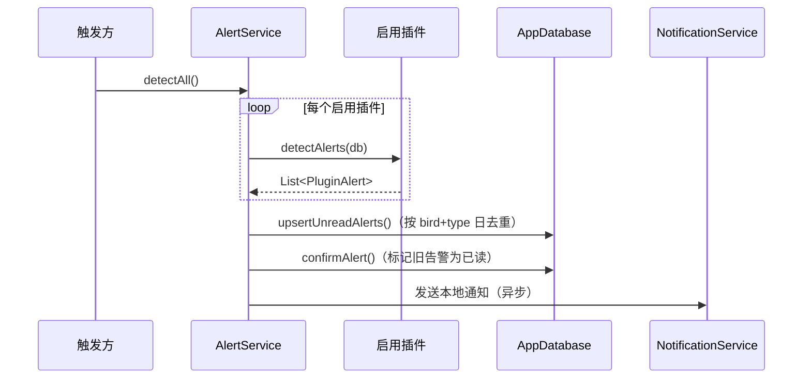
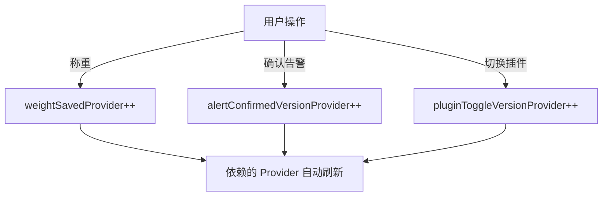

# 服务层

服务层封装了跨插件的业务逻辑，提供统一的基础设施服务。

---

## 服务一览

### OperationService — 统一写入服务

> 文件：`lib/services/operation_service.dart`

所有插件的写操作入口。确保每次写操作产生完整的审计记录。

| 方法 | 说明 |
|------|------|
| `record(...)` | 开启事务 → 写 ActivityLog → 完成 Task → 发 EventBus 事件 |
| `recordInTransaction(db, ...)` | 参与外部事务，同样写日志/完成任务/发事件 |
| `revokeOperation(logId)` | 撤销操作：重置关联 Task 状态，删除 ActivityLog |

```dart
await operationService.record(
  pluginId: 'weights',
  actionType: 'weight_recorded',
  birdId: bird.id,
  summary: '称重: 45.2g',
  details: {'weightG': 45.2},
  operatedBy: userId,
);
```

---

### AlertService — 告警聚合服务

> 文件：`lib/services/alert_service.dart`

聚合所有启用插件的 `detectAlerts()` 结果。

**工作流程：**



**关键方法：**

| 方法 | 说明 |
|------|------|
| `detectAll()` | 遍历所有启用插件，聚合告警，去重持久化 |
| `upsertUnreadAlerts(alerts)` | 按日去重（同 bird + 同 type = 同日不重复） |
| `confirmAlert(id)` | 标记告警为已读 |
| `getUnconfirmedAlerts()` | 获取未确认告警 |
| `getAllAlertRecordsWithStatus()` | 获取全部告警（含已确认） |

---

### BackupService — 备份恢复服务

> 文件：`lib/services/backup_service.dart`

**WNBK 格式**（自定义 ZIP 包）：

```
wnbk_backup.zip
├── manifest.json          # SHA256 完整性校验
├── weight_nest_mvp.db.sqlite    # SQLite 主数据库
├── weight_nest_mvp.db.sqlite-wal
├── weight_nest_mvp.db.sqlite-shm
└── gallery/               # 照片文件目录
```

| 方法 | 说明 |
|------|------|
| `createBackup()` | 打包数据库 + 照片为 WNBK，写入 manifest SHA256 |
| `restoreBackup(file)` | 校验 manifest → 替换数据库文件 + 照片目录 |

---

### BirdImportService / BirdExportService — 鸟只导入导出

> 文件：`lib/services/bird_import_service.dart`、`lib/services/bird_export_service.dart`

**WNBD 格式**（自定义 ZIP 包）：

```
wnbd_export.wnbirds
├── manifest.json          # SHA256 + 鸟只清单
├── birds/
│   └── {uuid}/
│       ├── bird.json       # 鸟只基本信息
│       ├── weights.json    # 体重记录
│       ├── medications.json # 喂药方案
│       ├── tasks.json      # 任务
│       ├── activity_logs.json
│       ├── alert_records.json
│       ├── photos.json
│       ├── avatars.json
│       └── breeding.json   # 繁育数据
```

**导入策略：**
- 品种匹配优先级：UUID 匹配 → 名称匹配 → 取第一个品种
- 每只鸟独立事务导入
- 使用批量 UUID 查询避免 N+1

**导出优化：**
- 7 个并行 DB 查询收集关联数据
- `Isolate.run()` 进行 ZIP 打包，不阻塞 UI 线程
- 照片按 8 张一批处理，内存控制在 ~60MB

---

### ExcelExportService — Excel 导出服务

> 文件：`lib/services/excel_export_service.dart`

两种导出模式：

| 模式 | 说明 |
|------|------|
| **月度体重矩阵** | 行=日期，列=鸟只，单元格=体重值；合并房间/容器单元格 |
| **药品库 + 剂量规则** | 两个 Sheet：药品清单 + 剂量规则表 |

---

### LicenseService — 许可证服务

> 文件：`lib/services/license_service.dart`

Pro 版本激活码验证：

- **激活码格式**：`WNPRO-<8hex时间戳>-<16hex随机>-<8hex签名>`
- **签名算法**：HMAC-SHA256
- **有效期**：10 分钟
- **密钥保护**：XOR 混淆
- **状态持久化**：SharedPreferences

---

### NotificationService — 本地通知服务

> 文件：`lib/services/notification_service.dart`

双 Android 通知通道：

| 通道 | 用途 |
|------|------|
| `task_overdue` | 任务逾期通知 |
| `alert` | 异常告警通知 |

**策略**：
- danger 级别告警单独发送
- warning 级别告警聚合发送
- Web 平台跳过初始化

---

### WorkHoursConfig — 工作时间配置

> 文件：`lib/services/work_hours_config.dart`

共享的工作时间配置，持久化到 SharedPreferences。

- 定义工作开始/结束时间
- 任务 `taskReadyTime` = 工作开始前 30 分钟
- 提供 `distributeDoses(timesPerDay)` 方法，在工作窗口内均匀分配喂药时间

---

### MotionPhotoService — 实况照片服务

> 文件：`lib/services/motion_photo_service.dart`

调用 Android 平台通道 `com.weightnest/file_helper`，从 Samsung / Google Pixel 的实况照片中提取嵌入的 MP4 视频。

---

### AppLogger — 应用日志

> 文件：`lib/services/log/app_logger.dart`

静态日志工具，支持 debug / info / warn / error 四级。
- Debug 模式使用 `dart:developer.log`
- Release 模式预留 Sentry/Crashlytics 集成（TODO）

---

## Riverpod Provider 全景

> 文件：`lib/providers.dart`

### 数据 Provider

| Provider | 类型 | 说明 |
|----------|------|------|
| `databaseProvider` | `Provider<AppDatabase>` | 数据库单例（同时注入 PluginRegistry） |
| `allBirdsProvider` | `FutureProvider` | 所有鸟只 + 品种/房间详情 |
| `allLatestWeightsProvider` | `FutureProvider<Map<int, Weight?>>` | 批量最新体重查询（避免 N+1） |
| `birdWeightsProvider(birdId)` | `FutureProvider.family` | 单只鸟体重列表 |
| `latestWeightProvider(birdId)` | `FutureProvider.family` | 单只鸟最新体重 |
| `allRoomsProvider` | `FutureProvider` | 所有房间 |
| `allSpeciesProvider` | `FutureProvider` | 所有品种 |
| `roomBirdsProvider(roomId)` | `FutureProvider.family` | 按房间筛选鸟只 |
| `roomEnclosuresProvider(roomId)` | `FutureProvider.family` | 房间内容器 |
| `enclosureBirdsProvider(encId)` | `FutureProvider.family` | 容器内鸟只 |
| `myRoomsProvider` | `FutureProvider` | 当前饲养员负责的房间 |

### 任务 Provider

| Provider | 类型 | 说明 |
|----------|------|------|
| `todayTasksProvider` | `FutureProvider` | 今日任务（当前饲养员） |
| `overdueTasksProvider` | `FutureProvider` | 逾期任务 |

### 告警 Provider

| Provider | 类型 | 说明 |
|----------|------|------|
| `_rawAlertsProvider` | `FutureProvider` | 触发告警检测 + 持久化 |
| `alertListProvider` | `FutureProvider` | 30 天未确认告警（从 DB 读取） |
| `allAlertsProvider` | `FutureProvider` | 全部告警（含已确认） |
| `alertCountProvider` | `Provider<int>` | 告警计数 |
| `hasRecentAlertRecordsProvider` | `FutureProvider<bool>` | 是否有告警（轻量 DB 查询） |
| `alertConfirmedVersionProvider` | `StateProvider<int>` | 确认后刷新计数器 |

### 药品 Provider

| Provider | 类型 | 说明 |
|----------|------|------|
| `medicationPlansProvider(birdId)` | `FutureProvider.family` | 单只鸟喂药方案 |
| `allDrugsProvider` | `FutureProvider` | 全部药品 |
| `allDiseasesProvider` | `FutureProvider` | 全部疾病 |

### 配置 Provider

| Provider | 类型 | 说明 |
|----------|------|------|
| `workHoursProvider` | `FutureProvider` | 工作时间配置 |
| `themeModeProvider` | `StateNotifierProvider` | 明暗主题 |
| `workerProvider` | StateNotifier | 当前选择的饲养员 |

### 刷新触发 Provider

| Provider | 类型 | 说明 |
|----------|------|------|
| `weightSavedProvider` | `StateProvider<int>` | 保存体重后递增，触发依赖刷新 |
| `pluginToggleVersionProvider` | `StateProvider<int>` | 插件启用/禁用后递增 |
| `initDefaultsProvider` | `FutureProvider<void>` | 首次启动种子数据 |

### Provider 刷新模式



> `weightSavedProvider` 是一个简单的 `StateProvider<int>`，每次保存体重后递增计数器，依赖它的 Provider 会因值变化而自动重新计算。这是一种手动失效模式（Manual Invalidation Pattern）。
